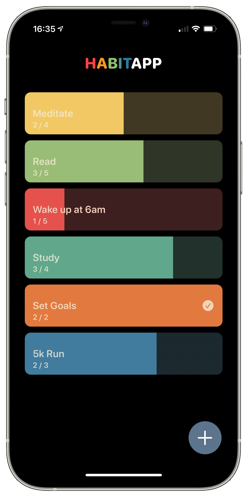
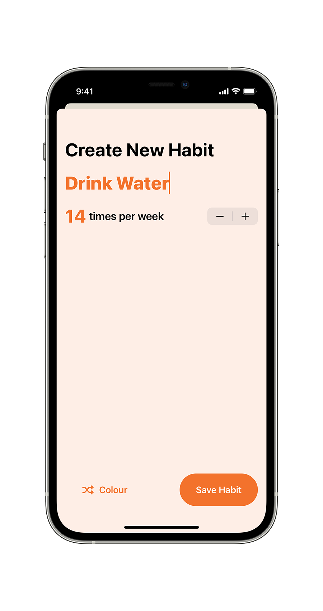

# Habitapp

Habitapp is the first of my one day build projects in SwiftUI. Whilst there are hundreds of incredible and beautifully designed habit trackers on the App Store, most have far more features than I would ever use. I set out to build a very simple UI with minimal user interactions, so that I can easily track my progress whilst focusing on the goals themselves. 

On the main screen, users can tap on each of their habits to add to the completion total. 
Swiping to the left will reset the habit to zero, whilst swiping to the right will delete the habit.

When the user taps the large plus button on the main screen a modal sheet appears asking the user to enter the name of a new habit and set how many times per week they wish to complete the activity. 

The shuffle colour button at the bottom of the screen will select a random colour from nine preset colours. 

The app is build entirely in SwiftUI and uses CoreData for persistence.
